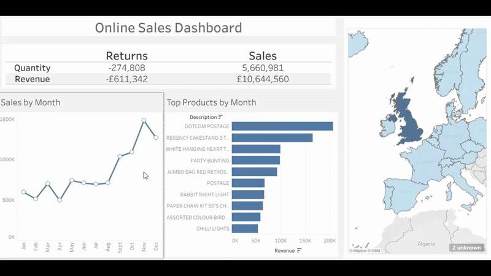

# 🛍️ UK Retail Data Analytics Project

## 📄 Project Overview

This project uses the **UCI Online Retail Dataset** to perform exploratory data analysis on UK e-commerce transactions. The focus is on understanding customer behaviour, revenue trends, and product performance using **PostgreSQL** and **Tableau**.

## 🧰 Tools Used
- **PostgreSQL 17**: Data cleaning, SQL queries, and KPI calculations
- **pgAdmin 4**: Database management interface
- **Tableau Public**: Visual dashboard creation

## 📊 Key Insights & KPIs Explored
- Monthly & weekly revenue trends
- Top 5 products by revenue each month
- Most returned items
- UK vs Non-UK sales comparison
- Sales by country
- Interactive filters to explore by month or country

## 🗃️ Dataset
- **Name**: Online Retail
- **Source**: [UCI Machine Learning Repository](https://archive.ics.uci.edu/ml/datasets/Online+Retail)
- **Size**: 541,909 rows, 8 columns (converted from Excel to CSV)

## 📂 Structure
- `retail_clean`: Cleaned table excluding nulls and invalid rows, but preserving valid returns
- KPI summary tables saved to PostgreSQL or exported to CSV for use in Tableau
- Tableau dashboards include:
  - Line charts for revenue over time
  - Bar charts for top products
  - Interactive filters for drill-downs

## ✅ How to Run
1. Import the CSV into PostgreSQL using pgAdmin
2. Run the SQL scripts for cleaning and KPI calculations
3. Export relevant tables as `.csv`
4. Connect Tableau to these CSVs or to PostgreSQL (if using Tableau Desktop)
5. Build interactive dashboards

## 📎 Notes
- Returns (`quantity < 0`) are retained if marked with credit invoices (`invoice_no LIKE 'C%'`)
- Duplicate rows are identified and removed using a row-ranking query
- Revenue is calculated as `quantity * unit_price`, including returns

---

Let me know if you'd like a version formatted for GitHub or for a printed portfolio!
